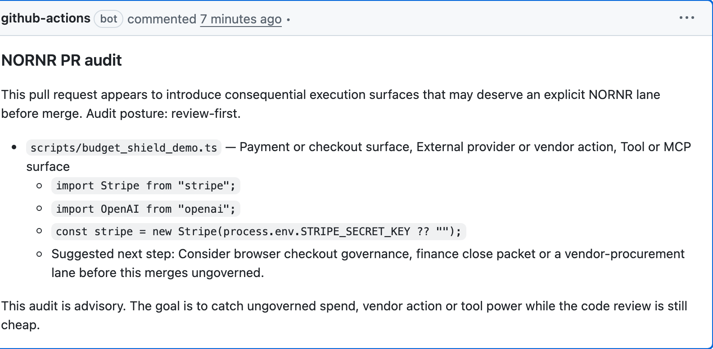

# NORNR Budget Shield

GitHub Action for one specific job:

comment on a pull request when new tool, payment, MCP, or vendor-action surfaces appear without an explicit NORNR control story.

This is not a generic lint rule.
It is a review-first control layer for consequential execution while the merge is still cheap.

If the repo already exists, the best NORNR sequence is:

1. run [Governance Audit](https://nornr.com/governance-audit) on the repo
2. install Budget Shield in pull requests
3. deepen the first governed lane with wrappers or MCP
4. carry the same lane into finance-safe proof later

Budget Shield is the install-first proof in that sequence.

## Live proof

- Public action repo: [NORNR/nornr-budget-shield](https://github.com/NORNR/nornr-budget-shield)
- Public demo repo: [NORNR/nornr-budget-shield-demo](https://github.com/NORNR/nornr-budget-shield-demo)
- Live demo pull request: [NORNR/nornr-budget-shield-demo#1](https://github.com/NORNR/nornr-budget-shield-demo/pull/1)

## Why teams install it

Use Budget Shield when you want NORNR to show up:

- inside the pull request
- before runtime power quietly reaches `main`
- before new spend or vendor paths become normal by accident

It is best for teams building:

- agent runtimes
- tool-using copilots
- MCP servers
- browser automation with paid or risky actions
- AI workflows that can touch vendors, billing, or real budgets

## Try it in 60 seconds

1. add the workflow below to `.github/workflows/nornr-budget-shield.yml`
2. optionally add `.nornr-pr-audit.json` in repo root
3. open or update a pull request that adds a payment, tool, MCP, or vendor-action surface

If the action finds a new consequential surface, it leaves one calm NORNR comment on the pull request.

## What it catches

- payment or checkout surfaces
- tool or MCP surfaces
- external provider or vendor actions
- first-seen consequential execution patterns that deserve an explicit NORNR lane before merge

The output is intentionally calm:

- which file changed
- what kind of consequential surface appeared
- which NORNR lane likely fits before merge
- why that lane is the right fit
- where the team should go next inside NORNR

## What it does not do

- it does not block merges on its own
- it does not replace runtime policy, review, or finance packet logic
- it does not try to comment on every code smell in the repo
- it should stay narrow enough that teams trust the comment instead of muting it

## Install in 60 seconds

```yaml
name: NORNR Budget Shield

on:
  pull_request:
    types: [opened, synchronize, reopened]

permissions:
  contents: read
  issues: write
  pull-requests: write

jobs:
  audit:
    runs-on: ubuntu-latest
    steps:
      - uses: actions/checkout@v4
        with:
          fetch-depth: 0

      - uses: NORNR/nornr-budget-shield@v1
        with:
          severity: review-first
```

Full workflow example: [`examples/pull-request.yml`](./examples/pull-request.yml)

## Optional config

Budget Shield looks for `.nornr-pr-audit.json` in the target repository root.

Start with this:

```json
{
  "severity": "review-first",
  "exclude": ["tests/", "docs/"],
  "rules": [
    {
      "id": "payments",
      "label": "Payment or settlement surface",
      "pattern": "stripe|checkout|invoice|billing|transfer|wallet\\.send",
      "suggestion": "Route the new spend path through one NORNR lane before merge so review, counterparty posture and finance packet stay explicit."
    }
  ]
}
```

Full example: [`.nornr-pr-audit.json.example`](./.nornr-pr-audit.json.example)
Minimal example: [`examples/review-first-config.json`](./examples/review-first-config.json)

## Inputs

- `node-version`
  - Default: `22`
- `config-path`
  - Default: `.nornr-pr-audit.json`
- `severity`
  - Default: `advisory`

## Example PR comment

Review-first PR guardrail for consequential execution:



Caption: Budget Shield comments before consequential runtime power quietly reaches `main`.

```md
### NORNR PR audit

This pull request appears to introduce consequential execution surfaces that may deserve an explicit NORNR lane before merge. Audit posture: review-first.

- `src/runtime/payments.ts` — Payment or checkout surface, External provider or vendor action
  - `const stripe = new Stripe(process.env.STRIPE_SECRET_KEY);`
  - Likely NORNR surface: browser checkout governance
  - Why this lane: A spend path and an external counterparty appear in the same change.
  - Suggested next step: Route the new spend path through one reviewed release lane before merge so the payment surface keeps counterparty posture, approval state and finance-safe export attached.
  - Learn more: https://nornr.com/browser-checkout-governance
```

## What a good install looks like

- the repo already has real code or active pull requests
- the comment appears only when a consequential surface is introduced
- the team can read the comment and immediately name the likely NORNR lane
- the next step is obvious: wrapper, MCP, browser lane, or another named control path

## Dogfooding

Budget Shield is already used in NORNR's own repo via:

- [`/.github/workflows/nornr-pr-comment-audit.yml`](https://github.com/Onechan/NORNR/blob/main/.github/workflows/nornr-pr-comment-audit.yml)

That matters because this action is supposed to feel like trusted review infrastructure, not an experiment we only ask other teams to run.

## How to think about it

Budget Shield is strongest when it stays narrow:

- diagnostic first
- review-first language
- one suggested control story

It is not trying to block every merge.
It is trying to stop teams from accidentally widening runtime authority without noticing.

## Related NORNR surfaces

- Governance Audit: [nornr.com/governance-audit](https://nornr.com/governance-audit)
- PR Comment Audit explainer: [nornr.com/pr-comment-audit](https://nornr.com/pr-comment-audit)
- Spend-aware wrappers: [nornr.com/spend-aware-wrappers](https://nornr.com/spend-aware-wrappers)
- MCP control layer: [nornr.com/mcp-control-server](https://nornr.com/mcp-control-server)
- Monthly audit surface: [nornr.com/monthly-close-memo](https://nornr.com/monthly-close-memo)

## Release discipline

- pin production installs to `@v1`
- create semver tags for every public release
- keep the action narrow enough that teams trust the comment and do not mute it

See [RELEASING.md](./RELEASING.md), [UPGRADING.md](./UPGRADING.md), and [MARKETPLACE.md](./MARKETPLACE.md).
